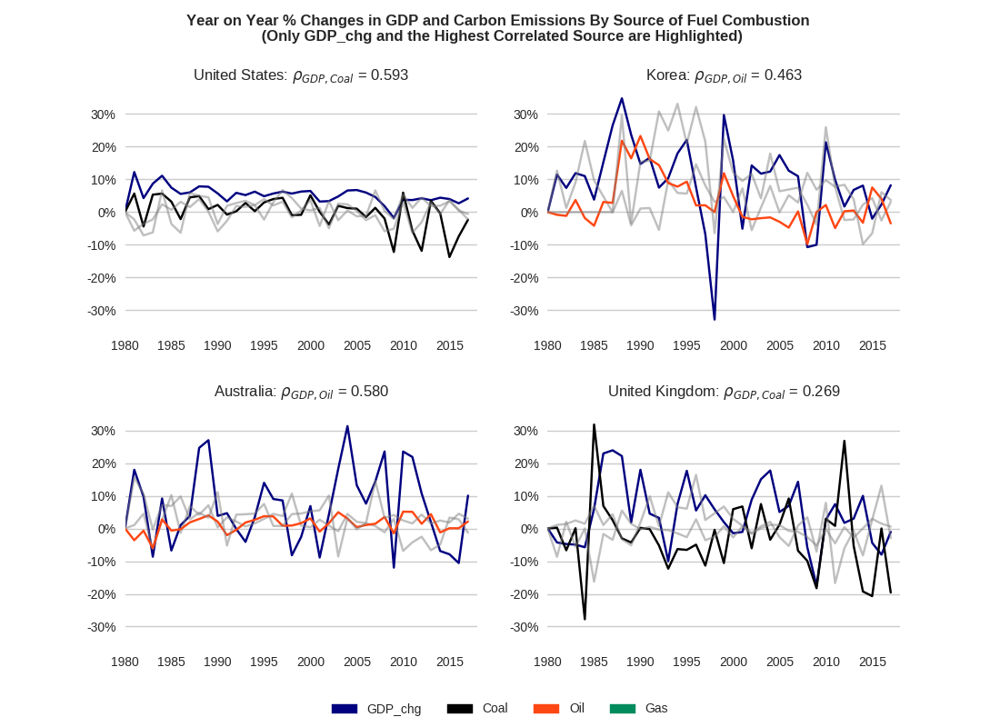

# gdp_carbon_emissions

This project was part of my final project in the "Applied Plotting, Charting and Data Representation in Python" course offered on Coursera by University of Michigan. I work in finance and with the trend that is ESG (Environmental Social Governance) pervading the industry, it was hard to resist working on something related to this topic. For this particular project, I chose to investigate the relationship between a country's economic activity and its level of carbon emissions. 

As the objective of this course was to enhance my data visualization capabilities, there's not much of work done in terms of machine learning or regression analysis here (I'll get there someday). What I sought to achieve was relatively simple - create a visual that depicted how GDP-emissions relationships differed across different countries. 

Below is a snippet of my final result




I've tried to make my code as abstract as possible, allowing the user to perform his/her analysis across a list of countries and different time periods. All the user would have to do is enter a list of countries of interest, and the start year and the Python notebook would take care of the rest and churn out a corresponding visual. 

```
COUNTRIES = ['United States', 'Korea', 'Australia', 'China']
start = 1980
```
